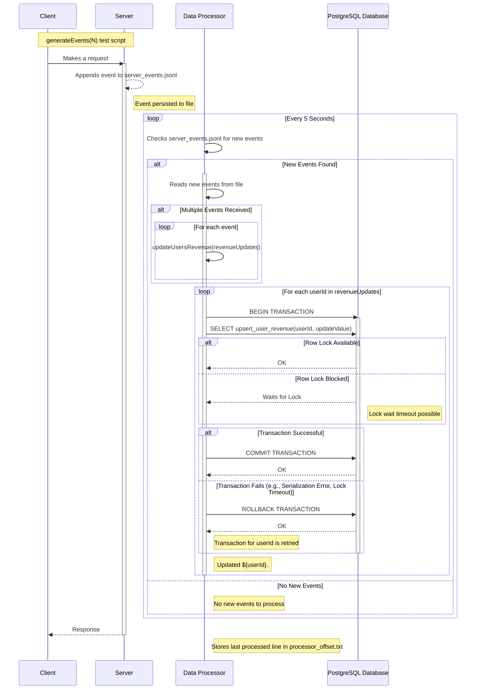

# Data ETL Project (Client-Server)

   __TLDR;__ test results show that 2M events (100.71MB) (used `generateEvents(400000)` from [below script](#1-generate-large-amount-of-events-to-trigger-the-etl-without-restarting-the-processes)) are processed in about 30 minutes (357 5-second-partitioned even logs)
   
   Upon initial startup, the 3 processes (client/server/data processor) will only listen and not do anything. Once you follow instructions from __[Testing](#testing)__, the process flow described in the __[Sequence diagram](#sequence-diagram)__ will begin.
   

**How to run**

   ```bash
   npm install

   # Install Postgresql or use a dockerized one. 
   
   # Ensure you have psql also installed and postgres:postgres@localhost:5432/postgres is a valid connection url
   npm run init-db 
   
   npm start
   ```

**Project Summary**

This project implements a basic data ETL process _highlighting the challenges of building a reliable data pipeline without specialized tools like Kafka or AWS SNS/SQS etc_. It consists of three main components:

* **Client (`client.js`):** _(Simulates a Kafka producer)_ 

    * Extracts user revenue update events from a file (`events.jsonl`) and sends them to the server's `/liveEvent` endpoint.

    * Watches `events.jsonl` file, and upon `change` event resends all events again. This is for ease of experimentation. Refer to [Testing the Project](#testing) for details on generating events and trigger the ETL

* **Server (`server.js`):** _(Simulates a Kafka broker)_

    * Exposes `/liveEvent` endpoint. Every event that `client.js` sends, the `server.js` will append to `server_events_${fiveSecondsWindowPartitionNumber}.jsonl` file _(Simulates a Kafka topic)_. 
    
    * Exposes `userEvents/:userId` endpoint that returns recor for particular user from db's `users_revenue` table 

* **Data Processor (`data_processor.js`):** _(Simulates Kafka consumer)_ 

    * Every 5 seconds it reads _all_ `server_events_*.jsonl` files _(poorly simulating Kafka consumer fetching from the Broker)_ and
        * _(Taken approach a.)_ aggregates all revenue updates deltas per user
        * updates database in transaction, per user
    * Maintains `processor_offset.json` where it keeps track for the processing of every time-partitioned event log

**Limitations**

* There are retry mechanisms in place for sending the event to server, and also for updating the database, _however_, if maximum attempts are reached an event will just be left unprocessed
* Every 5 seconds scanning for _all_ `server_events*.jsonl` degrades performance with time. A mechanism for marking a partition as done should be implemented.

## Sequence diagram


## Testing

There are two useful scripts that we can use for experimenting with the project

#### 1 Generate large amount of events to trigger the ETL without restarting the processes

Open a `node` console at the root of the project and paste the below js code.

Then, by invoking `generateEvents(N)` you will generating `events.jsonl` file repeating the example 5 jsonlines `N` times

Example usage: `generateEvents(400000)` Will produce `events.jsonl` with total size of __100.71MB__

```js
function generateEvents(numTimes = 1) {
  const events = [
    { "userId": "user1", "name": "add_revenue", "value": 98 },
    { "userId": "user1", "name": "subtract_revenue", "value": 72 },
    { "userId": "user2", "name": "add_revenue", "value": 70 },
    { "userId": "user1", "name": "add_revenue", "value": 1 },
    { "userId": "user2", "name": "subtract_revenue", "value": 12 },
  ];

  let output = "";
  for (let i = 0; i < numTimes; i++) {
    output += events.map(event => JSON.stringify(event)).join('\n');
    if (i < numTimes - 1) {
      output += '\n';
    }
  }

  fs.writeFileSync('events.jsonl', output);
  console.log(`Generated events.jsonl with ${events.length * numTimes} events.`);
  return numTimes
}
```

#### 2 Check the number of processed events, while ETL is running

With below script, you can continiously call `aggregateOffsets()` to check up until where the ETL has reached, knowing the total number of events you generated from the script in [1.](#1-generate-large-amount-of-events-to-trigger-the-etl-without-restarting-the-processes)

In the same node console from [1.](#1-generate-large-amount-of-events-to-trigger-the-etl-without-restarting-the-processes) paste also this script:

```js
const fs = require('fs');

function aggregateOffsets() {
  try {
    const offsetData = JSON.parse(fs.readFileSync('processor_offset.json', 'utf8'));
    const totalOffset = Object.values(offsetData).reduce((sum, offset) => sum + offset, 0);
    console.log('Total offset:', totalOffset);
  } catch (err) {
    console.error('Error reading or processing offset file:', err);
  }
}

aggregateOffsets();

``` 
- Get a rough idea of how long the etl process was running 
    - _NOTE_: does counts only the producing of events. Actual ETL end is when the `aggregateOffsets()` from [2.](#2-check-the-number-of-processed-events-while-etl-is-running) reaches the number of events you started the process with
```bash
echo $(( $(find server_events* -type f | wc -l) * 5 / 60 )) minutes
```
- useful for tracking memory and CPU usage (PIDs are printed as part of the process logs)
```bash
ps aux | grep node | awk '{print $2, $3 " %CPU", $6/1024 " MB"}'
```
